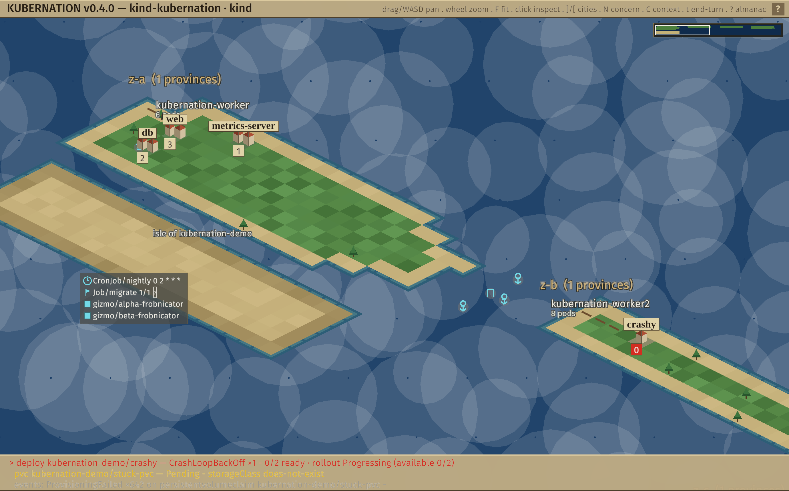
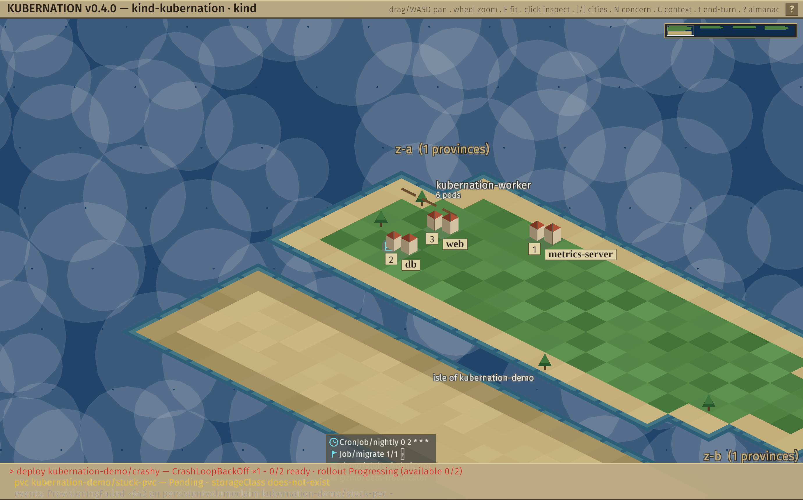
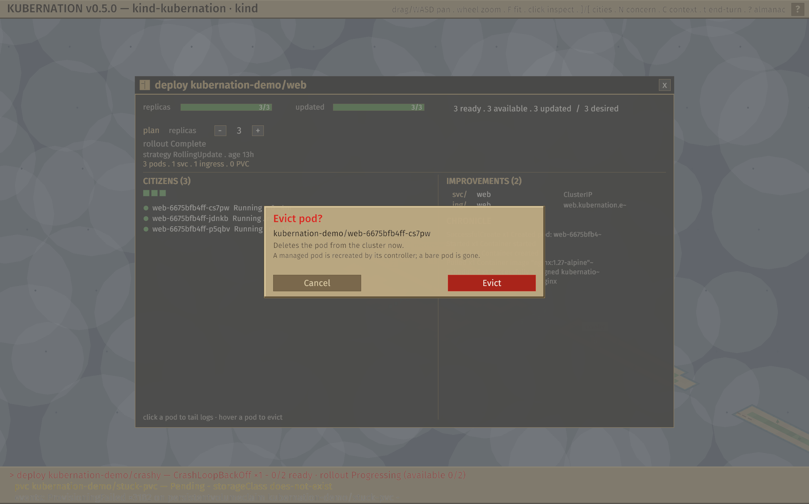

# Kubernation

<p align="center">
  
</p>

**The cluster as a living world.** A terminal UI for observing Kubernetes,
built on the interface grammar of early Sid Meier's Civilization: a 2D
world you explore — zones are continents, nodes are provinces of terrain,
workloads are cities sited where their pods run — plus a "city screen"
giving one workload full context, and an attention queue that brings
problems to you — the *next unit needing orders* — instead of making you
go hunting through dashboards.

This is not a retro skin on k9s. It is a different operator model:

- **Spatial, not tabular.** Your resources project onto a stable world
  map; geography means something (failure domains, placement, drift).
- **Attention-driven.** Failing pods, stuck rollouts, pending PVCs, nodes
  under pressure — aggregated, ranked, and one keypress (`n`) from their
  full context.
- **Near observe-only.** Kubernation reads the cluster and does not change
  it — with one deliberate, gated exception: **pod eviction** (a real
  delete), invoked only from the GUI behind an explicit confirm. The entire
  write surface is one small file (`k8s/actions.rs`). The planning turn
  (`PlannedWorld`: scale / cordon) stays preview-only — staged diffs are shown
  but never applied.

```text
 KUBERNATION ▏kind-kubernation ▏kind ▏https://127.0.0.1:50970/ ▏4n·25p                     overlay PRESSURE ▏? help
~≈ z-a · 1 ≈                   ≈ z-b · 1 ≈                  ≈ z-c · 1 ≈        ┌ WORLD ────────────┐
 ▣ kubernation-worker ●5 ≣3      ~  ▣ kubernation-worker2 ●6 ≣3       ▣ kubernation-worker3   │ ┌              ┐  │
 ,    ,    ,    ,    ,         ,   ◍0‼   ,    ,    ,    ~   ,    ,    ,    ,   │  ▪ ▪ ▪ ▪          │
    ,    ,    ,    ,    ,  ~      ,crashy   ,    ,          ,    ,   ◍2   ,    │ └              ┘  │
                 ~              ,◍3  ,    ,    ,            ,  coredns  ,      ├ STATUS ───────────┤
       ~                  ~   ,  web    ,    ,    ,    ~    ,    ,    ,    ,   │ 4 provinces 6 cities
                ~                ◍2   ,    ,    ,           ~                  │ 25 pods  ‼1 !1 ·1
      ~                  ~     , db ,    ,    ,    ,                  ~        ├ ORDERS ───────────┤
  ≈ kubernation-demo ≈  ·          ~                  ~                  ~          │ ◍ crashy
   ✦ gizmo/alpha-frob…                  ~                  ~                   │ pop 0 of 2 desired
 · ✦ gizmo/beta-frobn…     ~                  ~                  ~             │ ‼ needs attention
┌ ATTENTION (3) ───────────────────────────────────────────────────────────────────────────────────┐
│▸‼ deploy kubernation-demo/crashy — CrashLoopBackOff ×2     0/2 ready · rollout Progressing (0/2)      │
│ ! pvc kubernation-demo/stuck-pvc — Pending                 storageClass does-not-exist                │
└──────────────────────────────────────────────── n cycles · Tab focuses · a collapses ────────────┘
```

*(Real capture from `make dev` — crashy's city flies a `‼` flag with
population 0, the `✦` structures on the isle of kubernation-demo are live
custom resources, and `≣3` marks three daemonset roads per province.)*

## Quick start

Requirements: Rust (stable), Docker, `kind`, `kubectl`.

```sh
make dev          # create a 4-node kind cluster, apply samples, launch TUI
```

Or against any cluster you can already reach:

```sh
cargo run --release -- --context <kubeconfig-context>
```

Useful targets: `make smoke` (headless connect + world summary),
`make lint`, `make test`, `make kind-down`.

### Hot/warm pair

```sh
make warm-up warm-drift   # second kind cluster + deliberate drift
make pair                 # both worlds side by side
```

Or against real clusters: `kubernation --context prod --warm prod-standby`.
The map splits into two continents (`h`/`l` past the edge crosses over),
the workload list gains a SYNC column (`=` in sync, `≠r` replica drift,
`≠i` image drift, `−w` missing on warm), the city screen gets a pair line,
and the attention queue merges both worlds with `H`/`W` tags plus a single
aggregate drift concern.

### GUI client (windowed)


```sh
make gui    # or: cargo run -p kubernation-gui --release -- --context <ctx>
```

The same `kubernation-core` world rendered as a real strategy-game view
(macroquad), on a classic-4X **isometric 2:1 diamond** map — the
rectangular model underneath stays the canonical coordinate system; the
GUI projects it to diamonds (render-only). **All-original procedural
terrain** (health-tinted, dithered land diamonds keyed to node health,
inked shorelines, trees on healthy land); **procedural settlements** that
grow from a single hut to a walled keep with population, each with a solid
population box and a **serif name banner** (the classic city-label
convention) — plus warning banners over troubled cities; namespace isles
with structure marks, hover tooltips, right-drag panning, wheel zoom around
the cursor, minimap click-to-jump, smooth camera flights on `]`/`[` and
`N`, and detail drill-downs: click a city for its **city window**, click
land for its **province window** — both centered modals (below). **Click
any pod row** to tail its logs in a live overlay (refreshed every couple of
seconds):


Clicking a city opens a **4X-style city window** — the city screen
reframed for Kubernetes: replicas/updated gauges, a pod **census** grid +
clickable pod list, **improvements** (Services / Ingress / PVCs / config),
and a **chronicle** of recent events.


Clicking land opens the matching **province (node) window**: zone & health,
cpu/mem gauges, the **garrison** of pods stationed there, the node's
**terrain** (runtime / kubelet / OS / arch), and its **conditions**.


A city's network exposure is moored off its east coast — Service **harbors**
(anchors) and Ingress **gates** (arches), each on the latitude of the city
it serves; hover for the route, click to open the city:



Persistent storage shows as a **granary** (silo) inland of any city that
mounts PVCs — cyan when every claim is Bound, yellow when one is pending:



Batch work lands on the **namespace islands**: Jobs as expeditions (a
pennant + completion status, yellow when failed), CronJobs as clocks showing
their schedule — beside the custom-resource structures:


Press **`?`** (or `F1`, or the top-bar `?`) for the **Almanac** — an in-app
reference, drawn on a reusable popup-window system, that documents the map's
whole visual vocabulary with the *actual marks* beside each definition, plus
the world metaphor, controls, and how to read state. Legend entries that
have a live example light up with a `>` — click one to fly the camera
straight to it (`1`-`4` / `←→` switch pages):


**The planning turn.** Intervention is framed as deliberate *staged* changes,
not imperative edits. Set replicas from a city window (`plan replicas [−] N
[+]`) or cordon a node from its province window; the change is staged, not
applied. Press **`t`** (or the chrome **End Turn (N)**) for the End-of-Turn
review — a from→to diff of everything staged, with per-row unstage and
Discard. **It is preview-only:** Commit is shown but disabled and *nothing is
written to the cluster* — the planning turn never writes; you just rehearse
the turn.


**Evict a pod.** The one direct cluster action: hover a pod in a city's
**citizens** (or a node's **garrison**) list and an **`evict`** button
appears; clicking it raises a confirm, and on confirm Kubernation issues a
real `DELETE` (a managed pod is recreated by its controller; a bare pod is
gone). It is the only write the app performs — one small, auditable path
(`k8s/actions.rs`) behind an explicit confirm. It is **RBAC-aware**: the
button is disabled (**`locked`**) unless a `SelfSubjectAccessReview` says you
may delete pods in that namespace. The **TUI** has it too — `e` on the
selected pod, with a y/n confirm and the same permission check.



Press **`c`** to switch the hot
cluster from a context picker — no restart. Labels use **Fira Sans** with
**Liberation Serif** for place-name banners (both bundled OFL); the map is
all original procedural geometry (no sprite assets), so the binary stays
self-contained.

With `--warm` (`make gui-pair`) the standby cluster rises as a **second
archipelago** east of the hot one — one sea, free panning between them,
`F` fits both on screen:


Every city carries a sync chip beside its population box (`=` in sync,
`#r`/`#i` drift, `-w` missing on warm), tooltips and panels are tagged
HOT/WARM, the city panel gains a pair line, and the attention strip
merges both worlds with `[H]`/`[W]` tags plus the single aggregate
drift concern.

### Performance rig

```sh
make perf-up      # kwok-simulated cluster: 100 nodes (5 zones), 1000 pods
make perf         # run the TUI against it
make perf-test    # release-mode budget test: rebuild + frame < 100ms
make perf-down
```

Measured on an M4 Max: a full world rebuild (map + workloads + attention)
plus a rendered 140×40 frame at 100 nodes / 1000 pods takes **~0.5ms
average, <1ms worst** (`make perf-test`); against the live kwok cluster, 40
freshly scaled-up pods were reflected in the UI **81ms** after `kubectl
scale` returned. Input redraws immediately; world churn coalesces at the
tick (250ms default), so a noisy cluster can never make typing lag.

## Keys

| Key | Action |
| --- | ------ |
| `h j k l` / arrows | move cursor / selection |
| `]` / `[` | sail to next / previous city |
| `PgUp/PgDn` · `Ctrl+u/d` · `Home/End` | page the map · half page · west/east continent |
| `Enter` | open the thing under the cursor |
| `l` | tail the selected pod's logs (city / node screen) |
| `Esc` / `Backspace` | back |
| `m` / `w` | map · workload list |
| `n` | **next concern** — jump to the top problem's view |
| `a` / `Tab` | expand attention panel · focus it |
| `1` `2` `3` | map overlay: pressure · replica health · namespace |
| `c` | switch kube context |
| `?` | full keymap |
| `q` / `Ctrl-C` | quit |

## Reading the world

```
≈ z-a · 1 ≈                    ≈ z-b · 1 ≈
 ▣ kubernation-worker ●5 ≣3      ~  ▣ kubernation-worker2 ●6 ≣3
 ,    ,    ,    ,    ,         ,   ◍0‼   ,    ,    ,
    ,    ,    ,    ,    ,  ~      ,crashy   ,    ,
                 ~              ,◍3  ,    ,    , ∏Ψ
       ~                  ~   ,  web    ,    ,    ,   (gate · harbor)
  ≈ kubernation-demo ≈  ·   ~
   ◷ CronJob/nightly 0 2 * * *
   ◈ Job/migrate 1/1 ✓
   ✦ gizmo/alpha-frob…          ~
 · ✦ gizmo/beta-frobn…
```

Zones are **continents**; each node is a **province** of land whose
terrain texture tells its state (`,` grass · `=` cordon fence · `∩`
drought/pressure · `×` wasteland/NotReady). Workloads are **cities**
(`◍N` — population = ready replicas, flagged `‼`/`!` when concerning)
sited on the province hosting most of their pods, so a city *migrates
when its pods do*. DaemonSets pave `≣` roads instead of building cities.
A city's network exposure is moored off its **east coast**: Services are
`Ψ` **harbors**, Ingresses are `∏` **gates** (the shoreline is the network
boundary). Persistent storage sits inland: a `⊞` **granary** west of any
city that mounts PVCs (yellow if a claim is unbound). Anything with no place
on the land lives on **namespace islands** in the southern sea: projected
custom resources (`✦`), zero-pod workloads (`◌`), and batch work — Jobs as
`◈` **expeditions** (with completion status) and CronJobs as `◷` schedules.
Walk anywhere with `h/j/k/l`; `]`/`[` sail city to city; `Enter` opens
whatever you stand on.

Pods keep their glyphs in city and node screens: `●` ready · `◐` starting
· `○` pending · `◌` terminating · `✗` failing · `◆` succeeded. The cpu/mem
gauges show **scheduling pressure** (requests ÷ allocatable) by default;
calm is green, elevated (≥70%) yellow, high (≥90%) red. Install
metrics-server (`make metrics-up`) and the gauges switch automatically to
**live usage** — the status bar reads `gauges live`, node detail shows
`cpu use`, the GUI panel says `live usage`. No metrics-server, no problem:
it falls back to requests on its own.

On terminals ≥110 columns the map gains the world sidebar: **WORLD** (the
chart: green land on blue ocean, `┌┐└┘` framing your viewport), **STATUS**
(provinces/cities/pods/concerns — your people and gold), and **ORDERS**
(whatever the cursor stands on — city, province, structure, or open sea).
Narrower terminals get a floating WORLD chart instead.

### Projecting custom resources

```sh
kubernation --context prod --project certificates.cert-manager.io --project gizmos.example.com
```

Each `--project` (or config `projections = [...]`) resolves the CRD at
connect and watches its instances live; they appear as `✦` structures on
their namespace's island. CRDs absent on a cluster are skipped quietly —
a hot/warm pair may project asymmetrically.

The default palette is **atlas**: parchment chrome, green terrain, white
city labels, blue ocean — with red and yellow strictly reserved for things
needing attention. Prefer the old restrained look? `color = "plain"` in
`~/.config/kubernation/config.toml`; `color = "mono"` for no color at all.

## The conceptual model

The CNCF landscape's layers, reframed as concentric zones of operator
agency: provisioning is the continent (out of scope), runtime is terrain
(node detail), orchestration is the game board (the map), app definition is
what your cities produce (the city screen), observability is a property of
every view, platforms are the politics of the world (status bar). The full
design brief is in [kubernation-tui-mvp-prompt.md](kubernation-tui-mvp-prompt.md);
architecture and decisions live in [CLAUDE.md](CLAUDE.md).

## Configuration

Optional file at `~/.config/kubernation/config.toml`:

```toml
tick_ms = 250              # world-change coalescing cadence
color = "auto"             # "auto" (atlas) | "plain" | "mono"
attention_expanded = false # start with the panel expanded
```

CLI: `--context`, `--kubeconfig`, `--log-level`, `--smoke`. Diagnostics go
to `~/.local/state/kubernation/kubernation.log` — never stderr, which would corrupt
the TUI.

## Status

Near observe-only — the one write is the confirmed **pod eviction** above;
everything else reads. Many post-MVP features are built: the isometric world
map, hot/warm cluster pairs, metrics-server live usage, the minimap, pod log
tailing, the connectivity / storage / batch map layers, the in-app Almanac,
the city + province drill-down windows, and the **planning turn** — staging
interventions and previewing their diff (preview-only; nothing is applied).
Deferred, by design: *applying* staged changes to the cluster (dry-run +
confirm + RBAC), more interventions, external managed services, chaos layers,
and the planning turn in the TUI. See CLAUDE.md for the full list and the
reasoning.

## Trademark

*Kubernation is an independent, unaffiliated homage. It is not associated
with, endorsed by, or sponsored by Take-Two Interactive Software, Inc.,
Firaxis Games, or the Civilization franchise. Sid Meier's Civilization and
Civ are trademarks of Take-Two Interactive, referenced here only to describe
this project's design inspiration.*
