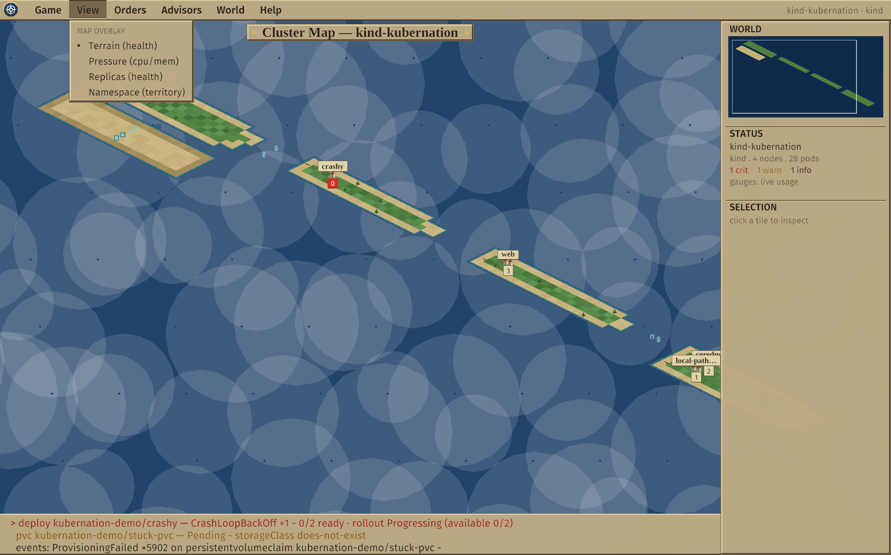

# Kubernation

<p align="center">
  
</p>

**The cluster as a living world.** A windowed (macroquad) client for observing
Kubernetes, built on the interface grammar of early Sid Meier's Civilization: a
2D world you explore — zones are continents, nodes are provinces of terrain,
workloads are cities sited where their pods run — plus a "city screen"
giving one workload full context, and an attention queue that brings
problems to you — the *next unit needing orders* — instead of making you
go hunting through dashboards.

This is not a retro skin on k9s. It is a different operator model:

- **Spatial, not tabular.** Your resources project onto a stable world
  map; geography means something (failure domains, placement, drift).
- **Attention-driven.** Failing pods, stuck rollouts, pending PVCs, nodes
  under pressure — aggregated, ranked, and one keypress (`N`) from their
  full context (and `L` straight into the offending pod's logs).
- **Near observe-only.** Kubernation reads the cluster and does not change it —
  with two deliberate, gated, RBAC-aware writes: **pod eviction** (a real
  delete) and **committing a planning turn** (apply staged scale / cordon /
  restart / image, server-side dry-run validated). The entire write surface is
  one small file (`k8s/actions.rs`); staging itself never writes.


*(A real capture from `make dev`: a classic-4X isometric world — crashy's city
flies a warning flag, the `✦` structures on the isle of kubernation-demo are
live custom resources, daemonsets pave roads across the provinces.)*

> A ratatui terminal UI shipped first; it was removed 2026-06-18 to focus on the
> one windowed frontend — k9s already serves the headless-terminal niche, and the
> 4X metaphor is a graphical one. The pure data/model core (`kubernation-core`)
> is unchanged.

## Quick start

Requirements: Rust (stable), Docker, `kind`, `kubectl`.

```sh
make dev          # create a 4-node kind cluster, apply samples, launch the client
```

Or against any cluster you can already reach:

```sh
cargo run --release -- --context <kubeconfig-context>
```

Useful targets: `make smoke` (headless connect + world summary — a UI-free
core check), `make lint`, `make test`, `make kind-down`.

### Hot/warm pair

```sh
make warm-up warm-drift   # second kind cluster + deliberate drift
make pair                 # both worlds side by side
```

Or against real clusters: `kubernation --context prod --warm prod-standby`.
The standby rises as a second archipelago east of the hot one (detailed
below); cities carry sync chips, and the attention queue merges both worlds
with `H`/`W` tags plus a single aggregate drift concern.

### The map

The `kubernation-core` world is rendered as a real strategy-game view
(macroquad), on a classic-4X **isometric 2:1 diamond** map — the
rectangular model underneath stays the canonical coordinate system; the
GUI projects it to diamonds (render-only). **All-original procedural
terrain** (health-tinted, dithered land diamonds keyed to node health,
inked shorelines, trees on healthy land); **procedural settlements** that
grow from a single hut to a walled keep with population, each with a solid
population box and a **serif name banner** (the classic city-label
convention) — plus warning banners over troubled cities; namespace isles
with structure marks, hover tooltips, right-drag panning, wheel zoom around
the cursor, minimap click-to-jump, smooth camera flights on `]`/`[` and
`N`, and detail drill-downs: click a city for its **city window**, click
land for its **province window** — both centered modals (below). The chrome
is classic-4X: a **dropdown menu bar** (Game / View / Orders / Advisors /
World / Help), a **docked right column** (WORLD minimap · STATUS · SELECTION),
and a cartographic **map title** over the board. **Click any pod row** to
tail its logs in a live overlay (refreshed every couple of seconds):


Clicking a city opens a **4X-style city window** — the city screen
reframed for Kubernetes: replicas/updated gauges, a pod **census** grid +
clickable pod list, **improvements** (Services / Ingress / PVCs / config),
and a **chronicle** of recent events.


Clicking land opens the matching **province (node) window**: zone & health,
cpu/mem gauges, the **garrison** of pods stationed there, the node's
**terrain** (runtime / kubelet / OS / arch), and its **conditions**.


**Map views.** The **View** menu recolors the whole board (and the minimap)
like a classic-4X map display: **Terrain** (node health, the default),
**Pressure** (cpu/mem heat), **Replicas** (worst workload health per node —
red where a city is understrength), or **Namespace** (a per-namespace hue, a
political/territory map). The active view is named in the title and STATUS so
a recolored terrain isn't mistaken for `NotReady`:




More Kubernetes kinds read as geography (see the Almanac legend below for the
exact marks): a city's network exposure is moored off its east coast — Service
**harbors** (anchors) and Ingress **gates** (arches), each on the latitude of
the city it serves; persistent storage is a **granary** (silo) inland of any
city that mounts PVCs (cyan when Bound, yellow when pending); and batch work
lands on the **namespace islands** — Jobs as expeditions (a pennant + status,
yellow when failed), CronJobs as clocks showing their schedule, beside the
custom-resource structures:


Press **`?`** (or `F1`, or the **Help** menu) for the **Almanac** — an in-app
reference, drawn on a reusable popup-window system, that documents the map's
whole visual vocabulary with the *actual marks* beside each definition, plus
the world metaphor, controls, and how to read state. Legend entries that
have a live example light up with a `>` — click one to fly the camera
straight to it (`1`-`4` / `←→` switch pages):


**Advisors.** The **Advisors** menu opens the classic-4X advisor screens —
read-only summary reports of the whole realm that complement the attention
queue: **Health** (provinces/nodes by health, citizens/pods by phase,
cities/workloads at strength), **Storage** (granaries/PVCs bound vs. pending,
with the pending claims), and **Network** (harbors/services + gates/ingresses,
plus orphan gates and idle harbors). The reports are pure functions of the
observed world (`kubernation-core`), unit-tested and cluster-wide:


**The planning turn.** Intervention is framed as deliberate *staged* changes,
not imperative edits. Set replicas from a city window (`plan replicas [−] N
[+]`) or cordon a node from its province window; the change is staged, not
applied. Press **`t`** (or the **Orders** menu's End of Turn) for the
End-of-Turn review — a from→to diff of everything staged, with per-row unstage and
Discard. **Commit** (behind a confirm) applies the turn to the cluster: each
staged change is **server-side dry-run validated first** — which also enforces
RBAC — so a turn the cluster would reject is blocked before any real write,
and per-row results show right in the review. Staging itself never writes; only
Commit does.


**Evict a pod.** The one direct cluster action: hover a pod in a city's
**citizens** (or a node's **garrison**) list and an **`evict`** button
appears; clicking it raises a confirm, and on confirm Kubernation issues a
real `DELETE` (a managed pod is recreated by its controller; a bare pod is
gone). It is the only write the app performs — one small, auditable path
(`k8s/actions.rs`) behind an explicit confirm. It is **RBAC-aware**: the
button is disabled (**`locked`**) unless a `SelfSubjectAccessReview` says you
may delete pods in that namespace.


Press **`c`** to switch the hot
cluster from a context picker — no restart. Labels use **Fira Sans** with
**Liberation Serif** for place-name banners (both bundled OFL); the map is
all original procedural geometry (no sprite assets), so the binary stays
self-contained.

With `--warm` (`make pair`) the standby cluster rises as a **second
archipelago** east of the hot one — one sea, free panning between them,
`F` fits both on screen:


Every city carries a sync chip beside its population box (`=` in sync,
`#r`/`#i` drift, `-w` missing on warm), tooltips and panels are tagged
HOT/WARM, the city panel gains a pair line, and the attention strip
merges both worlds with `[H]`/`[W]` tags plus the single aggregate
drift concern.

### Performance rig

```sh
make perf-up      # kwok-simulated cluster: 100 nodes (5 zones), 1000 pods
make perf         # run the client against it
make perf-test    # release-mode budget test: model rebuild < 100ms
make perf-down
```

Measured on an M4 Max: a full world rebuild (map + workloads + attention — what
the client recomputes each tick) at 100 nodes / 1000 pods takes **~1ms**
(`make perf-test`); against the live kwok cluster, 40 freshly scaled-up pods
were reflected in the UI **81ms** after `kubectl scale` returned. World churn
coalesces at the tick (250ms default), so a noisy cluster can't make the UI lag.

## Controls

Mouse-first, with a classic-4X menu bar and a few keys (the in-app **Almanac**,
`?`, has the full list):

| Input | Action |
| --- | ------ |
| drag · `WASD`/arrows · wheel | pan · pan · zoom (cursor-anchored) |
| `F` · `]`/`[` | fit the world · sail to next / previous city |
| click land / city / harbor | open the node / city drill-down window |
| click a pod row | tail its logs (overlay) |
| hover a pod row → **fwd** | port-forward it to `127.0.0.1` (RBAC-gated; stop from the FORWARDS column) |
| `y` | inspect YAML (the read-only dossier) |
| `N` · `L` | next concern · tail that concern's offending pod |
| `:` | resource browser — any kind |
| `Esc` | close the topmost overlay |
| `?` / `F1` | the Almanac (legend · controls · how to read state) |
| menu bar | switch context · fit · map overlay · namespace · advisors · quit |

## Reading the world

```
≈ z-a · 1 ≈                    ≈ z-b · 1 ≈
 ▣ kubernation-worker ●5 ≣3      ~  ▣ kubernation-worker2 ●6 ≣3
 ,    ,    ,    ,    ,         ,   ◍0‼   ,    ,    ,
    ,    ,    ,    ,    ,  ~      ,crashy   ,    ,
                 ~              ,◍3  ,    ,    , ∏Ψ
       ~                  ~   ,  web    ,    ,    ,   (gate · harbor)
  ≈ kubernation-demo ≈  ·   ~
   ◷ CronJob/nightly 0 2 * * *
   ◈ Job/migrate 1/1 ✓
   ✦ gizmo/alpha-frob…          ~
 · ✦ gizmo/beta-frobn…
```

Zones are **continents**; each node is a **province** of land whose
terrain texture tells its state (`,` grass · `=` cordon fence · `∩`
drought/pressure · `×` wasteland/NotReady). Workloads are **cities**
(`◍N` — population = ready replicas, flagged `‼`/`!` when concerning)
sited on the province hosting most of their pods, so a city *migrates
when its pods do*. DaemonSets pave `≣` roads instead of building cities.
A city's network exposure is moored off its **east coast**: Services are
`Ψ` **harbors**, Ingresses are `∏` **gates** (the shoreline is the network
boundary). Persistent storage sits inland: a `⊞` **granary** west of any
city that mounts PVCs (yellow if a claim is unbound). Anything with no place
on the land lives on **namespace islands** in the southern sea: projected
custom resources (`✦`), zero-pod workloads (`◌`), and batch work — Jobs as
`◈` **expeditions** (with completion status) and CronJobs as `◷` schedules.
Walk anywhere with `h/j/k/l`; `]`/`[` sail city to city; `Enter` opens
whatever you stand on.

Pods keep their glyphs in city and node screens: `●` ready · `◐` starting
· `○` pending · `◌` terminating · `✗` failing · `◆` succeeded. The cpu/mem
gauges show **scheduling pressure** (requests ÷ allocatable) by default;
calm is green, elevated (≥70%) yellow, high (≥90%) red. Install
metrics-server (`make metrics-up`) and the gauges switch automatically to
**live usage** — the status bar reads `gauges live`, node detail shows
`cpu use`, the GUI panel says `live usage`. No metrics-server, no problem:
it falls back to requests on its own.

A docked right column rides beside the map: **WORLD** (the minimap — green land
on blue ocean, a frame marking your viewport; click to recenter), **STATUS**
(provinces/cities/pods/concerns — your people and gold), and **SELECTION**
(whatever you clicked or hover — city, province, structure, or open sea).

### Projecting custom resources

```sh
kubernation --context prod --project certificates.cert-manager.io --project gizmos.example.com
```

Each `--project` (or config `projections = [...]`) resolves the CRD at
connect and watches its instances live; they appear as `✦` structures on
their namespace's island. CRDs absent on a cluster are skipped quietly —
a hot/warm pair may project asymmetrically.

The palette is **atlas**: parchment chrome, green terrain, white city labels,
blue ocean — with red and yellow strictly reserved for things needing attention.

## The conceptual model

The CNCF landscape's layers, reframed as concentric zones of operator
agency: provisioning is the continent (out of scope), runtime is terrain
(node detail), orchestration is the game board (the map), app definition is
what your cities produce (the city screen), observability is a property of
every view, platforms are the politics of the world (status bar). The full
design brief is in [kubernation-tui-mvp-prompt.md](kubernation-tui-mvp-prompt.md);
architecture and decisions live in [CLAUDE.md](CLAUDE.md).

## Configuration

The client is driven by CLI flags — `--context`, `--kubeconfig`, `--warm`,
`--project` (repeatable), `--log-level`. Diagnostics are written to
`~/.local/state/kubernation/kubernation.log` (`RUST_LOG` also honored). The
headless `make smoke` check is a separate, UI-free core example. (The removed
TUI also had a `config.toml`; the windowed client has no config file yet.)

## Status

Near observe-only — two gated writes (confirmed **pod eviction** and a
**committed planning turn**) plus one active-but-non-mutating capability,
RBAC-gated **port-forward**; everything else reads. Built well past the MVP: the
isometric world map, hot/warm cluster pairs, metrics-server live usage (with
cpu/mem trend sparklines), the
minimap + map overlays, pod log tailing (severity coloring, timestamps, filters,
concern→logs), the connectivity / storage / batch map layers, the resource
browser (`:any kind`), the read-only YAML inspector, the in-app Almanac, the
advisor screens, the city + province drill-down windows, and the **planning
turn** — staging interventions, previewing the diff, and committing it
(server-side dry-run + RBAC + confirm). Deferred, by design: more interventions,
external managed services, chaos layers, and the bigger log tiers (all-containers
picker, multi-pod tailing). See CLAUDE.md for the full list and the reasoning.

## Trademark

*Kubernation is an independent, unaffiliated homage. It is not associated
with, endorsed by, or sponsored by Take-Two Interactive Software, Inc.,
Firaxis Games, or the Civilization franchise. Sid Meier's Civilization and
Civ are trademarks of Take-Two Interactive, referenced here only to describe
this project's design inspiration.*
